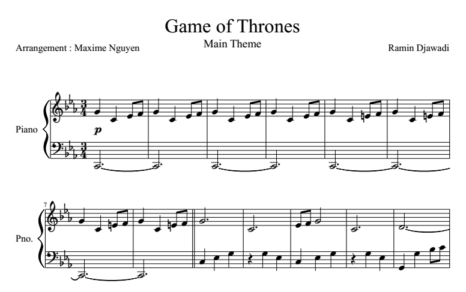

Musical ML
===================

##   Musical ML

Musical ML est un projet dans le cadre du cours de *Domain Specific Language* (DSL). Le groupe est composé de Lisa JOANNO, Nicolas LECOURTOIS et Fabien VICENTE.

Ce DSL est adressé aux musiciens. Ils peuvent retranscrire leur partition littéralement sur notre DSL. À partir de ce DSL, ils peuvent lancer le code généré directement sur un Arduino.

Le code généré joue la musique sur un haut-parleur et transmet des commandes au LCD pour afficher des animations correspondantes à la dite musique.

##  Utiliser le DSL

### Syntaxe
La syntaxe du DSL est la suivante : 

    color blue
    speaker 8
    screen 12
    bpm 170
    key ¤
    serial HIGH

Vous pouvez donc spécifier la couleur des leds du LCD, le pin du haut-parleur, le pin de l'écran LCD, le tempo de la musique, les altérations à la clef de votre partition (voir la partie  [<i class="icon-upload"></i> Altération](#altération)), et activer ou non le LCD.

### Partition

Ensuite, la partition commence. 

Par exemple, pour la partition du générique de Game Of Thrones *best serie ever* : 

Le DSL correspondant est le suivant : 

    score
    -first- { sol3 do mi- fa- } -first- -first- -first-
    -second- { sol3 do =mi- fa-} -second- -second- -second-
    sol3+. do+. mi- fa- sol+ do mi- fa- re+. $-
    fa+. si2+. mi3- re- fa+ si2 mi3- re- do+.

####  Note

Chaque note a une hauteur. Le La de référence 440 a pour hauteur 3. Pour représenter une note à la noire sans altération, il suffit de spécifier son nom et sa hauteur : 

    sol3

Les notes qui suivront auront la même hauteur jusqu'à ce qu'une nouvelle hauteur soit spécifiée pour une note. 

####  Durée

La durée par défaut d'une note est la noire. Placer un '+' après le nom d'une note double sa durée. Une '-' la divise par deux. Ainsi, si la note est 'la' une blanche s'écrira 'la+', une ronde 'la++', une croche 'la-' et ainsi de suite.
Si votre note est pointée, placez un point à la suite de la durée. Par exemple un mi pointée s'écrira :

    mi++.

Le silence peut être exprimé via le caractère '$' suivi, comme pour les notes, de sa durée. Par défaut, la durée de la noire. Le demi-soupir s'écrit donc : 

    $-

####  Altération 
Placer '#', '¤' ou '=' devant votre note lui ajoute une altération accidentelle. 

**\#** <kbd>Alt Gr + 3</kbd> correspond au dièse ♯

**¤** <kbd>Alt Gr + $</kbd> correspond au bémol ♭

**=** <kbd>=</kbd> correspond au bécarre ♮

Exemple du ♭la:

    ¤la

####  Début de la partition

Pour déclarer que ce qui suit est le début de la transcription de votre partition, écrivez le mot "score", comme dans l'exemple : 

    score
    la3 mi-.

####  Répétition

Vous pouvez définir une suite de notes qui sont répétées, telles qu'un refrain. Pour cela, vous pouvez définir : 

    -refrain- { la3 mi }

Par la suite, vous pouvez réutiliser ces notes en écrivant :

    -refrain-

A noter que vous pouvez définir vos répétitions avant ou après le début de partition ("score"). Par exemple vous pouvez utiliser :

    -refrain- { la3 mi }
    score
    fa3 -refrain- mi3

##  Générer le code Arduino à partir du DSL

Lorsque vous avez écrit votre DSL, placez-le dans *input.txt*. Lancez le script :

    $ ./generate.sh 

Un fichier *output.txt* est apparu. 

##  Uploader sur votre Arduino !

#### Profitez de votre musique

Dans ArduinoIDE, copiez le contenu du fichier *output.txt*, sélectionnez le bon port, et profitez de votre musique !

#### Visualisez votre musique

Si vous souhaitez utiliser l'écran, vous devez faire les configurations nécessaires. Voir la partie [<i class="icon-upload"></i> Configuration](#configuration).

##  Configuration

L'utilisation complète du DSL nécessite d'avoir installé :
- Arduino IDE **1.6**
- Python 2.7
- L'écran LCD, qui est une Arduino Duemilanove ou Diecimila

Pour regénérer grammaires et binaires des ML : 

        ./build.sh

#### Utiliser l'écran LCD

Après avoir uploadé votre musique, repérez le port de l'arduino Uno (par exemple : "/dev/ttyACM0") et celui de l'arduino Duo.
Puis, lancez :

        python SerialPipe.py [PORT_UNO] [PORT_DUO]

> Note : vous devez avoir uploadé une musique avec *serial HIGH*.

Rebootez votre Arduino Uno. Enjoy !

===================

> Written with [StackEdit](https://stackedit.io/).
